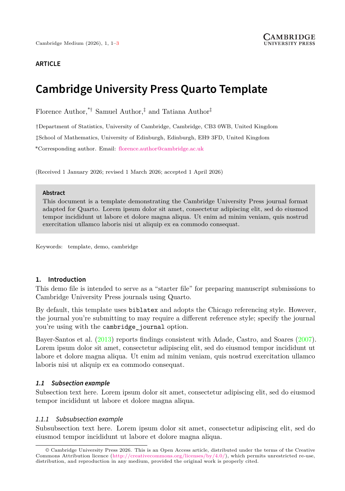

# Quarto template for Cambridge University Press journals




This Quarto template is based on the official Cambridge University Press
LaTeX class file (`cup-journal.cls`), available from Overleaf:
<https://www.overleaf.com/latex/templates/cambridge-university-press-medium-template/dgkxnqdhgwsx>

## Creating a New Article

To create a new article using this format:

```bash
quarto use template ihrke/cambridge
```

This will create a new directory with an example document that uses this format.

## Using with an Existing Document

To add this format to an existing document:

```bash
quarto add https://github.com/ihrke/cambridge
```

Then, add the format to your document options:

```yaml
format:
  cambridge-pdf: default
```

## Options

All regular options are supported. In addition, the following options are available:

- `cambridge_journal`: One of `default`, `small`, `medium` (default), `large`, `largetwo`, `aas`, `bjps`, `jps`, `nws`, `pla`, `nlp`, `psrm`, `ram`, `ehs`, `btd`, `bel`, `one`, `qut`, `cbp`, `pri`, `rdi`, `chr`, `aog`, `jog`, `ash`, `pas`, `pasa`, `jlc`, `mdy`, `spq`. Each journal code triggers the appropriate page layout (small/medium/large/largetwo) and bibliography style.
- `manuscript_type`: One of `article` (default), `communication`, `letter`, `note`, `review`, `suppinfo`.
- `layout`: explicit layout override -- `traditional` (default), `small`, `medium`, `large`, `largetwo`.
- `year`: publication year (defaults to current year).
- `volume`: journal volume number.
- `doi`: the DOI string (rendered with `\doi{}`).
- `received`, `revised`, `accepted`, `published`: dates that appear on the title page when `dates-show` is `true`.
- `running-title`: short title used in page headers.

### Class option toggles

These map directly to `cup-journal.cls` boolean keys. Pass `true` or `false`.

- `simfonts`: use `fbb` / `sourcesanspro` / `sansmath` to approximate the commercial CUP fonts (default `true`).
- `super`: use superscript markers for author affiliations (default `true`).
- `articletitle`: show the manuscript-type label above the title (default `true`).
- `chaptertitle`: use a chapter-style title block (default `false`).
- `keywords-show`: print keywords below the abstract (default `true`).
- `abbreviations-show`: print the abbreviations list (default `true`).
- `jel-show`: print JEL classification codes (default `true`).
- `msc-show`: print MSC codes (default `true`).
- `suppmat`, `suppdata`: supplementary-material flags (default `false`).
- `orcid-show`: show ORCID icons next to authors (default `false`).
- `ack-show`, `contrib-show`, `financial-show`, `conflicts-show`, `ethics-show`: enable the corresponding statement sections in the title block (default `false`).
- `dates-show`: show received / revised / accepted dates on the title page (default `false`).
- `copyright-show`: show the CC-BY copyright notice (default `false`).
- `email-show`: show the corresponding-author email (default `true`).

### Front-matter fields

- `keywords`: a list of keywords.
- `jel`: a list of JEL classification codes.
- `msc`: a list of MSC codes.
- `abbreviations`: a string with the abbreviations list.
- `abstract`: the abstract text.

### End-matter statements

These render as `\paragraph{...}` blocks just before the bibliography:

- `acknowledgments`: a string with the acknowledgments
- `fundingstatement`: a string with the funding statement
- `competing`: a string with the competing-interests statement
- `dataavailability`: a string with the data-availability statement
- `ethicalstandards`: a string with the ethical-standards statement
- `authorcontributions`: a string with the author-contributions statement (CRediT roles)

### Authors and affiliations

Standard Quarto author metadata is supported. The corresponding author's email is emitted with `\email[Name]{address}`.

```yaml
author:
  - name: Florence Author
    corresponding: true
    email: f.a@cam.ac.uk
    affiliations:
      - name: Department of Statistics, University of Cambridge
        city: Cambridge
        country: United Kingdom
```

## Example

Here is the source code for a minimal sample document: [template.qmd](template.qmd).

And here is the rendered PDF file: [template.pdf](template.pdf).


## Development notes

I took the template from <https://www.overleaf.com/latex/templates/cambridge-university-press-medium-template/dgkxnqdhgwsx> on May 5, 2026.

The class file (`cup-journal.cls`) is shipped unmodified. If I ever need to update it, the only Quarto-specific consideration is that `cup-journal.cls` already loads `biblatex` itself (with a journal-appropriate style), so the bundled pandoc template (`template_cambridgecompat.tex`) suppresses pandoc's own `\usepackage{biblatex}` to avoid an option clash. Bibliographies declared in the YAML are passed to the class via `\addbibresource` and `\printbibliography` is emitted by the `biblio.tex` partial.
